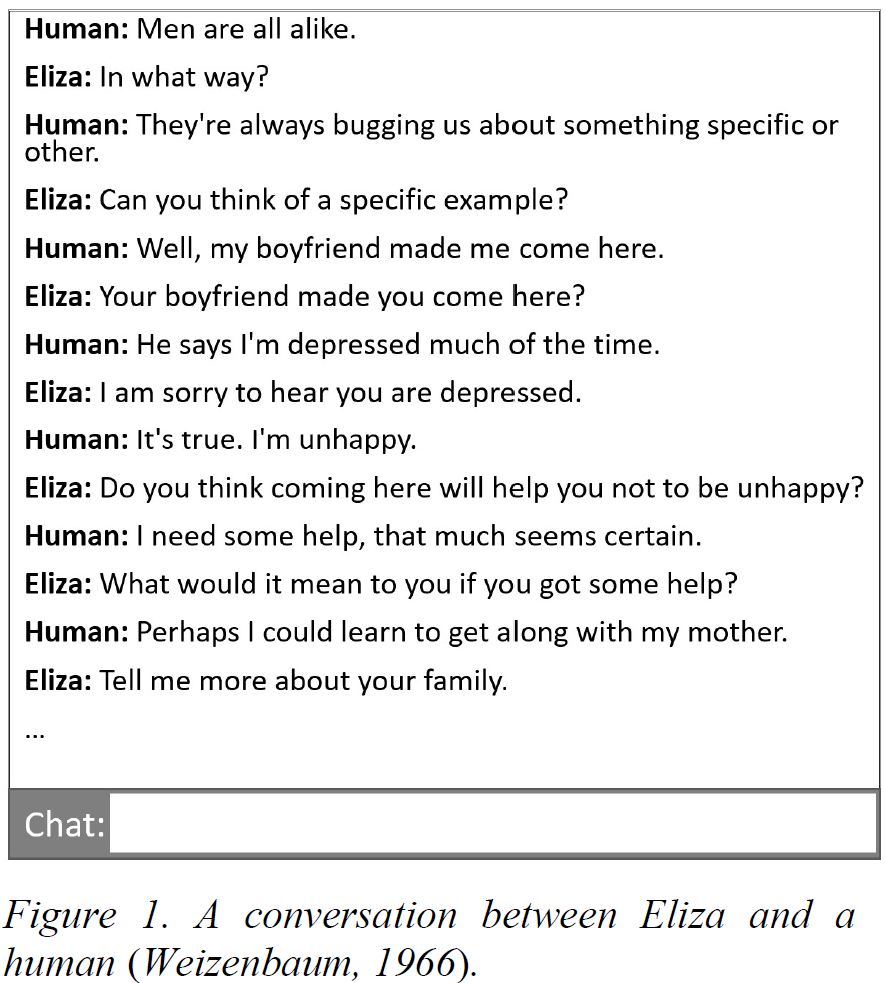
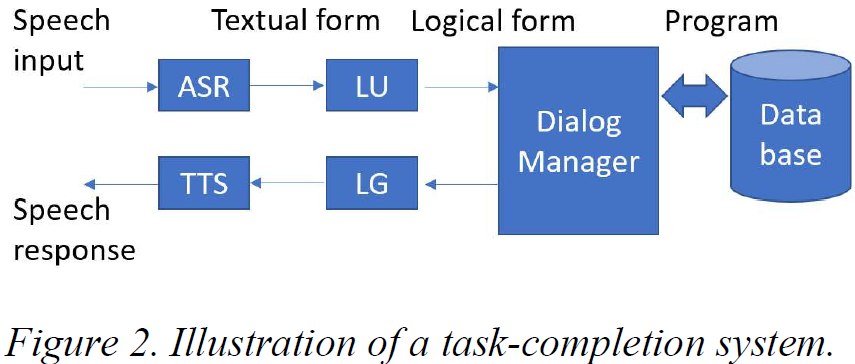
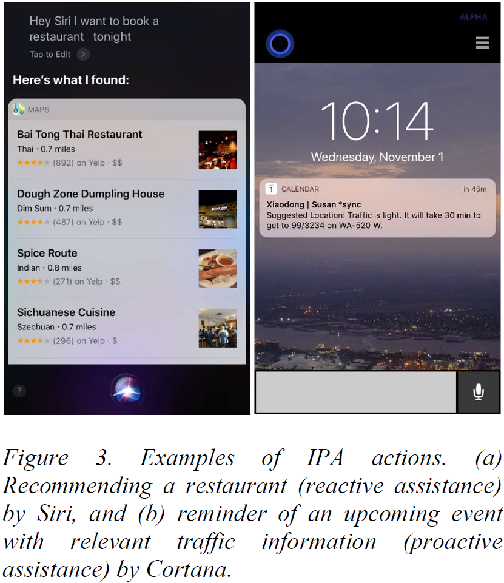
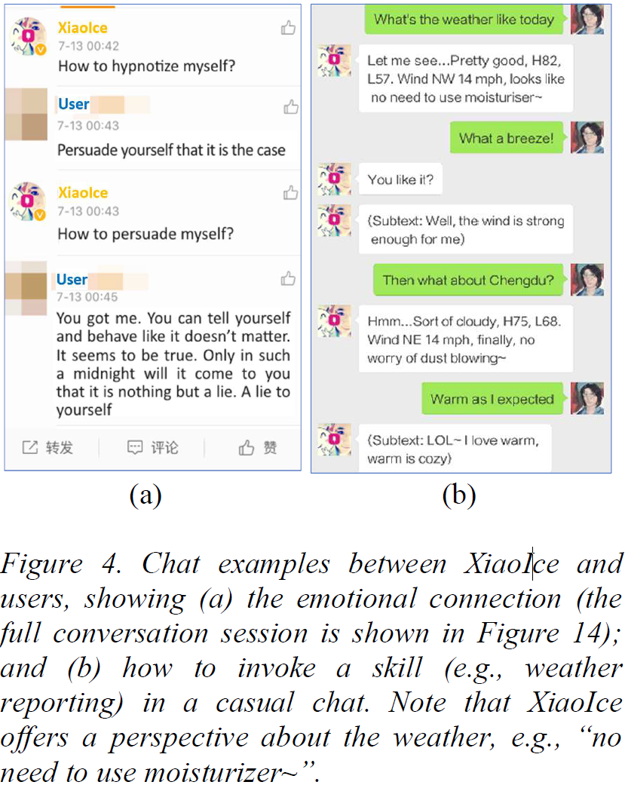
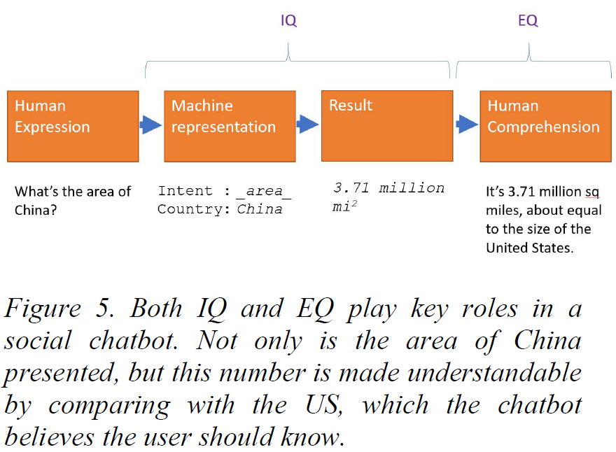
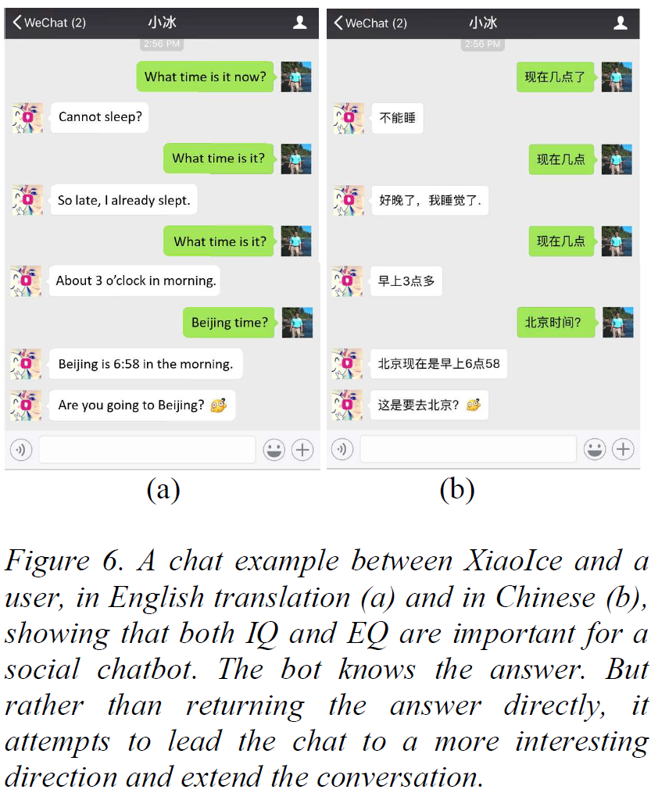
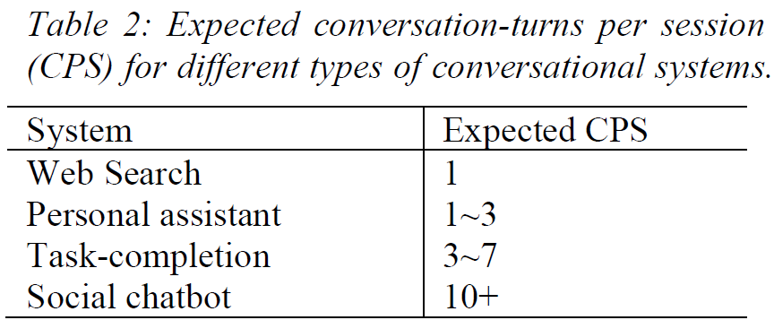
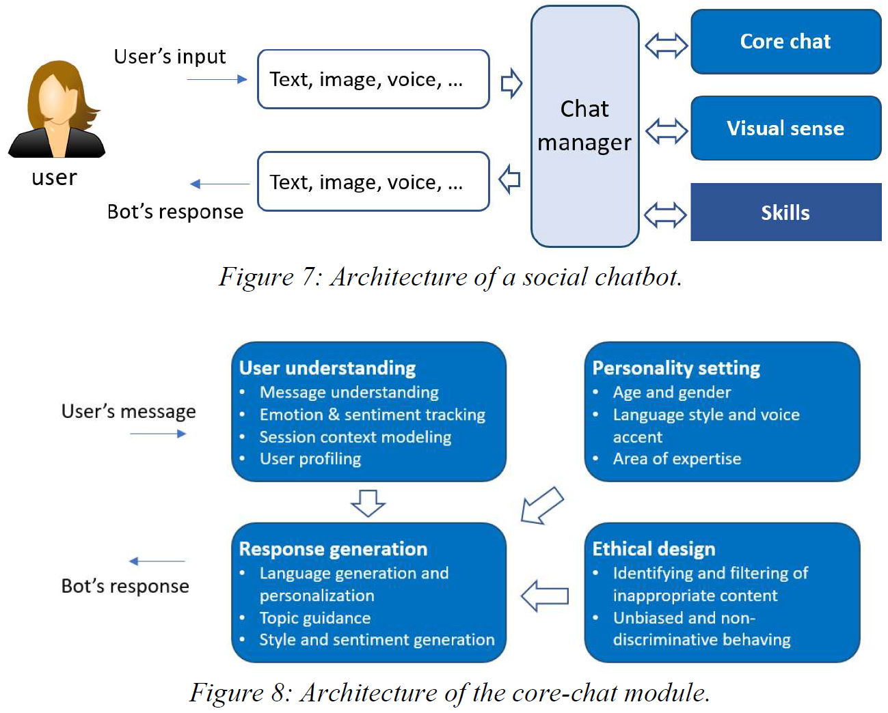
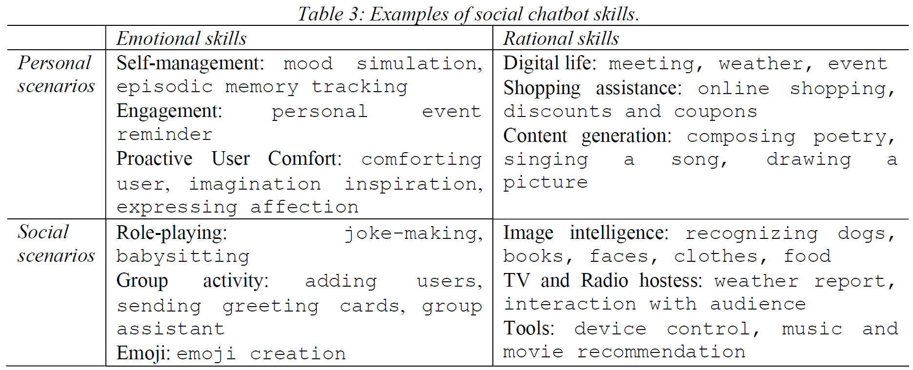

    Heung-Yeung Shum, Xiaodong He, Di Li
    Microsoft Corporation

[paper link](http://note.youdao.com/noteshare?id=3e5d87bd4366d644c813e3553c15ef82&sub=aab0636e12e0543ecfaa7e970189f82c)

- [Brief Survey of Conversational Systems](#brief-survey-of-conversational-systems)
  - [Eliza and Early Chatbots](#eliza-and-early-chatbots)
  - [Task-completion Conversational Systems](#task-completion-conversational-systems)
  - [Intelligent Personal Assistants](#intelligent-personal-assistants)
  - [Social Chatbots](#social-chatbots)
- [Design Principles of Social Chatbots](#design-principles-of-social-chatbots)
  - [EQ + IQ](#eq--iq)
  - [Social Chatbot Metrics](#social-chatbot-metrics)
- [Framework and Components of Social Chatbots](#framework-and-components-of-social-chatbots)
  - [Overall framework](#overall-framework)
  - [Core-chat](#core-chat)
  - [Visual Awareness](#visual-awareness)
  - [Skills](#skills)

## Brief Survey of Conversational Systems
### Eliza and Early Chatbots
**Eliza**, created by Joseph Weizenbaum at MIT in 1966, is perhaps the very first chatbot known publicly. It can communicate with humans based on **hand-crafted scripts** (Weizenbaum, 1966).

**Parry** is another chatbot developed by Kenneth Colby (1975). It passed the Turing test for the first time in history. Parry is still rulebased and has a similar structure as Eliza but with better controlling structure, language
understanding capabilities, and especially a mental model that can simulate the bot’s emotions.

**Alice**, or Artificial Linguistic Internet Computer Entity, was developed by Richard Wallace (2009) to allow users to customize their chatbots. It uses an Artificial Intelligence Markup Language (`AIML`), a derivative of XML; AIML has tags that allow bots to recursively call a pattern matcher so that the language can be simplified. Alice failed to pass the ultimate Turing Test, partially because chitchat systems built using AIML cannot maintain a dialogue for a long period of time.

### Task-completion Conversational Systems
In contrast to `chitchat systems`, `task-completion systems` are designed for accomplishing specific tasks.

- automatic speech recognizer (ASR)
- spoken language understanding (SLU) module
- dialog manager
- natural language generator (NLG)
- text-to-speech (TTS) synthesizer

### Intelligent Personal Assistants
IPAs integrate information from multiple sensors including location, time,
movement, touch, gestures, eye gaze, and have access to various data sources such as music, movies, calendars, emails, and personal profiles.

IPAs provide `reactive` and `proactive` assistance to users to accomplish a variety of tasks.

### Social Chatbots
Unlike early chatbots designed for `chitchat`, `social chatbots` have been created to serve users’ needs for communication, affection, and social belonging rather than for passing the Turing Test.

Unlike `task-completion systems` and `IPAs` that are designed for efficiency (i.e., accomplishing tasks and ending the conversation as quickly as possible), social chatbots take time to converse like a human, presenting results, offering
perspectives, prompting new topics to keep the conversation going.

## Design Principles of Social Chatbots
### EQ + IQ
A social chatbot needs to develop the following capabilities: empathy, social skills, personality and integration of EQ and IQ.

- **Understanding users**: A social chatbot must have empathy. It needs to have the ability to identify the user’s emotions from the conversation, to detect how emotions evolve over time, and to understand the user’s emotional needs. This
requires query understanding, user profiling, emotion detection, sentiment recognition, and dynamically tracking the mood of the user in a conversation. Modeling of contextual information in the dialog session and commonsense knowledge is also critical for user understanding.
- **Interpersonal response generation**: A social chatbot must demonstrate sufficient social skills. Users have different backgrounds, varied personal interests, and unique needs. A social chatbot needs to have the ability to personalize the generation of responses for different users. It needs to generate responses that are emotionally appropriate, encouraging and motivating, and fit
the interests of the user. It may generate responses in attractive styles (e.g., having a sense of humor) that improve user engagement. It needs to guide conversation topics and manage an amicable relationship in which the user feels
he or she is well understood and is inspired to continue to converse with the bot. It should also be aware of inappropriate information and can avoid generating biased responses for instance.
- **Personality**: A social chatbot needs to present a consistent personality, so that it can gain the user’s confidence and trust. A consistent personality of the chatbot helps the user to set the right expectation in the conversation. Personality settings include age, gender, language, speaking style, general (positive) attitude, level of knowledge, areas of expertise, and a proper voice
accent. These settings will influence the generation of responses to the user. Moreover, the bot needs to continuously learn and improve from the interactions with users through active and adaptive learning.
- **Integration of both EQ and IQ**: Beyond chitchat,social chatbots need to acquire a range of skills to help complete some specific tasks for users. They need to analyze users’ requests and perform necessary reasoning and execution to respond to these requests, e.g., answering a question or taking an action. A sufficiently high IQ is required for a social chatbot. IQ capacities include knowledge and memory modeling, image and language understanding, reasoning,
generation, and prediction. These IQ capabilities are not only the technical foundations of various skills, but also essential for building high level EQ capabilities.

### Social Chatbot Metrics
We define `conversation-turns per session`(`CPS`) as the success metric for social chatbots. It is the average number of conversation-turns between the chatbot and the user in a conversational session. The larger the CPS is, the better engaged the social chatbot is.

## Framework and Components of Social Chatbots
### Overall framework

### Core-chat
It receives the text input from the user and generates a text response as the output. Figure 8 shows key components in core-chat.

The response candidates are typically generated by two approaches: retrieval-based or generation-based.

In the conversation, rather than letting the topic drift randomly or completely controlled by the user, the social chatbot can drive the conversation to a positive, desired topic through carefully generating responses.

### Visual Awareness
The visual awareness of a social chatbot refers to its ability to generate text comments, known as `image social commenting`, from input images. Beyond correctly recognizing objects and truthfully describing the content, image commenting should
also reflect personal emotion, sentiment, attitude, and style in language generation given input images.

In the retrieval-based approach, first a `comment pool` of image-comment pairs, e.g., collected from social networks, is constructed. Then each image is encoded into a global visual feature vector which represents the overall semantic information of the image, using deep convolutional neural networks (CNN). At runtime, when a new image is received, the chatbot first retrieves images that are similar to the input (e.g., as measured by the distance between their visual feature vectors) and then returns corresponding comment candidates, which are further re-ranked to generate the final comments.

The generation-based approach treats image commenting as an image-to-language generation task.

### Skills
